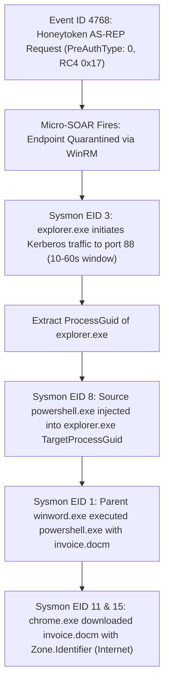

# Project Alpine: Enterprise Detection Engineering, Active Directory Deception & Automated Incident Response

[](https://attack.mitre.org/)
[](https://www.splunk.com/)
[](https://zeek.org/)
[](https://palletsprojects.com/p/flask/)

Project **Alpine** is a defensive security operations and detection engineering lab that demonstrates end-to-end detection, analysis, and automated containment of an advanced Active Directory intrusion. 

By pairing **Active Directory Honeytokens**, **behavioral network monitoring (Zeek & Suricata JA4)**, **in-memory process telemetry (Sysmon & SilkETW)**, and **Splunk Risk-Based Alerting (RBA)**, Alpine drives false positives toward zero and automates host quarantine within minutes of a confirmed risk-score breach.

---

## Architecture: Dual Virtual Switch Topology

The entire environment operates on a virtualized **Arch Linux** hypervisor host, running isolated victim workstations, a Domain Controller, and dual virtual switches:


* **Virtual Switch 1 (V.S 1) - Operational Plane**: Handles enterprise user traffic, Kerberos/LDAP, and C2 communication. Cloned via Linux Traffic Control (`tc mirred`) egress mirroring to the Arch host promiscuous sniffing interface (`IP: N/A`).
* **Virtual Switch 2 (V.S 2) - Management Plane**: Out-of-band network handling Splunk Universal Forwarder ingestion (`TCP 9997`) and WinRM containment (`TCP 5985`). Uses stateful `iptables` **DNAT** and **SNAT** (PAT) to ensure the SOC infrastructure IP remains hidden from internal network adversaries.

---

## Core Detection Capabilities

### 1. Active Directory Deception Engine (Honeytoken)
* Deploys a privileged decoy account (`svc_sql_prod_migration`) with `DONT_REQ_PREAUTH` (bit 4194304) enabled.
* Protected by a cryptographically random **64-character uncrackable password** and automated scheduled activity to maintain authentic `lastLogon` metadata for BloodHound/SharpHound collectors.
* Generates an immediate **0% false-positive** detection on Windows Event ID 4768 (`PreAuthType: 0`, `0x17` RC4 downgrade).

### 2. Behavioral Network Detection (Zeek & Suricata)
* **Zeek Beaconing Analytics**: Employs non-transformative `streamstats` queries in Splunk to mathematically isolate rigid 2.0-second time deltas with uniform payload byte sizes.
* **Suricata JA4 Cryptographic Fingerprinting**: Extracts and matches plaintext TLS Client Hello cipher suites and extensions to fingerprint Metasploit payloads over encrypted channels.
* **Community ID Flow Hashing**: Standardized 5-tuple flow hashing across Zeek and Suricata for instant cross-sensor pivots.

### 3. Endpoint Telemetry & Memory Inspection
* **Tuned Sysmon XML**: Captures process lineage (EID 1), anomalous Kerberos origins from `explorer.exe` (EID 3), unmanaged CLR loading in Office (EID 7), cross-process injection (EIDs 8 & 10), and Mark of the Web (EIDs 11 & 15).
* **SilkETW & YARA**: Ingests `Microsoft-Windows-LDAP-Client` kernel ETW events to flag SharpHound queries targeting administrative groups and AS-REP roastable accounts.
* **Reverse-Engineered Meterpreter Signatures**: Custom YARA rules detecting PEB traversal via `GS:[0x60]`, ROR-13 API hashing (`LoadLibraryA`, `VirtualAlloc`), and RWX memory allocation.

### 4. Automated Micro-SOAR Containment
* A lightweight Python/Flask webhook listener receives high-severity RBA triggers from Splunk.
* Executes an inline PowerShell firewall-quarantine routine on target workstations via WinRM over V.S 2, cutting all inbound and outbound traffic while preserving an out-of-band forensic pinhole scoped to the SOC's gateway VIP.

### 5. Post-Incident Detection: Phishing Email Triage
* A standalone Python script polls a monitored mailbox over IMAP, extracts IP addresses from each message's `Received` header chain, and scores them against AbuseIPDB's reputation API.
* Targets the same initial-access vector as the simulated attack chain (`invoice.docm` spearphishing -- see `attack-chain.md`); unlike the rest of the lab, it deliberately reaches real external services (Gmail IMAP, AbuseIPDB) rather than simulated lab traffic.

---

## Repository Structure

```
.
├── README.md
├── assets/
│   └── diagrams/
│       ├── topology.png                        # Rendered architectural network diagram
│       └── topology.svg                        # Editable SVG source for the diagram
├── docs/
│   ├── 01-architecture/
│   │   ├── network-topology.md                 # Complete breakdown of dual-switch lab design
│   │   └── network-plumbing-tc-iptables.md     # Linux tc mirror & iptables stealth NAT deep-dive
│   ├── 02-threat-model-and-attack/
│   │   ├── attack-chain.md                     # Adversary attack chain and telemetry mapping
│   │   ├── honeytoken-strategy.md              # Deception engineering & AS-REP roasting theory
│   │   └── meterpreter-reverse-engineering.md  # Ghidra & x64dbg analysis of reflective DLL injection
│   └── 03-incident-response/
│       ├── investigation-walkthrough.md        # Step-by-step forensic triage and pivot methodology
│       ├── detection-engineering-rba.md        # Splunk RBA framework & SPL query breakdown
│       ├── incident-response-report.md         # Formal executive IR report & RCA
│       └── phishing-email-triage.md            # Post-incident email/IP triage control
└── src/
    ├── network/
    │   ├── tc-tap-mirror.sh                    # Linux tc mirred packet cloning script
    │   └── iptables-nat-stealth.sh             # iptables DNAT/SNAT management isolation script
    ├── active-directory/
    │   ├── setup-honeytoken.ps1                # PowerShell script to provision AS-REP honeytoken
    │   └── simulate-dummy-logon.ps1            # Background activity simulation script
    ├── sysmon/
    │   └── sysmon-config.xml                   # Targeted Sysmon XML configuration
    ├── silketw-yara/
    │   ├── sharphound-ldap.yar                 # YARA rules for SharpHound LDAP queries
    │   ├── meterpreter-memory.yar              # YARA rules for in-memory stager shellcode
    │   └── silketw-config.json                 # SilkETW service JSON configuration
    ├── suricata/
    │   ├── suricata.yaml                       # Suricata engine config with JA4 & Community ID
    │   └── local.rules                         # Custom Suricata JA4 detection signatures
    ├── zeek/
    │   └── local.zeek                          # Zeek site policy for JSON logs & Community ID
    ├── splunk/
    │   ├── inputs.conf                         # Ingestion stanzas for endpoint and network logs
    │   ├── outputs.conf                        # Forwarder configuration with gateway VIP
    │   └── savedsearches.conf                  # Detection searches, streamstats, and RBA master rule
    ├── soar/
    │   ├── flask-soar-listener.py              # Micro-SOAR webhook listener + inline quarantine routine
    │   └── requirements.txt                    # Listener dependencies (flask, pywinrm)
    └── email-triage/
        ├── phishing-ip-triage.py                # Post-incident IMAP + AbuseIPDB phishing triage script
        └── requirements.txt                    # Script dependencies (requests)
```

---

## Setup Notes

* Install the SOAR listener's dependencies: `pip install -r src/soar/requirements.txt`
* The listener refuses to start unless both `ALPINE_WINRM_PASS` (the WinRM account password) and `ALPINE_WEBHOOK_TOKEN` (a shared secret Splunk must send as `?token=...` on the webhook URL, see `src/splunk/savedsearches.conf`) are set in its environment -- there are no hardcoded fallback credentials.
* WinRM traffic runs unencrypted over the lab's isolated V.S 2 management plane (pywinrm's default `plaintext` transport) -- acceptable here because V.S 2 has zero adversary reachability by design (see `network-plumbing-tc-iptables.md`), but not a pattern to carry outside a lab like this.

---

## Quick Reference: Key Investigation Flow


