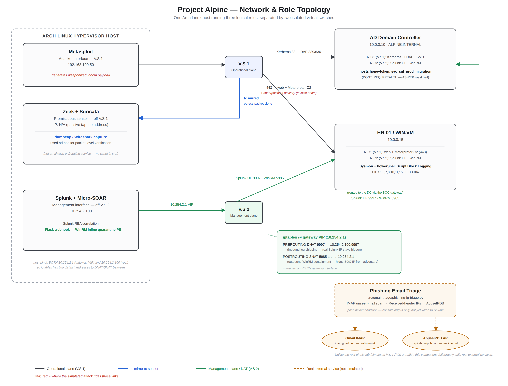

# Alpine Architecture: Dual-Switch Topology & Network Mirroring

## 1. Architectural Overview

Project **Alpine** is an enterprise detection engineering and incident response lab designed to validate high-fidelity detection mechanisms across endpoint telemetry, behavioral network monitoring, and active deception.

To achieve production-grade fidelity without enterprise hardware overhead, the entire infrastructure runs on a consolidated **Arch Linux** hypervisor host supporting victim endpoints, an Active Directory Domain Controller, and dual isolated virtual switches.

---

## 2. Infrastructure & Component Breakdown

### Host Multi-Role Segregation (Arch Linux)
The Arch host simultaneously hosts the offensive adversary tools and the defensive SOC stack, logically separated into three distinct network interfaces:
1. **Attacker Interface**: Operates Metasploit, web staging, and phishing infrastructure connected to **Virtual Switch 1 (V.S 1)**.
2. **Promiscuous Sniffing Interface (`IP: N/A`)**: Completely passive network sensor interface receiving mirrored packets via Linux Traffic Control (`tc`). Runs **Zeek** and **Suricata IDS** continuously against the mirrored feed; **dumpcap/Wireshark** was used ad hoc against the same feed for packet-level verification (e.g. confirming JA4 Client Hello matches), not as an always-on, auto-rotating capture service -- no capture/rotation script is checked into this repo.
3. **SOC Management Interface**: Manages log collection (**Splunk Indexer**) and automated incident response (**Python Micro-SOAR & WinRM**), communicating exclusively across **Virtual Switch 2 (V.S 2)**.

### Target Virtual Machines
1. **Windows Victim VM (`HR-01` / `WIN.VM`)**:
   - **NIC 1 (Data Plane)**: Connects to V.S 1. Simulates enterprise employee activity, web browsing, and outbound C2 communications.
   - **NIC 2 (Management Plane)**: Connects to V.S 2. Houses the Splunk Universal Forwarder (Sysmon EIDs 1, 3, 7, 8, 10, 11, 15, Windows Security logs) and WinRM service (`TCP 5985`).
2. **Active Directory Domain Controller (`AD / Server`)**:
   - **NIC 1 (Data Plane)**: Connects to V.S 1. Handles Kerberos (`TCP/UDP 88`), LDAP (`TCP 389/636`), and SMB services. Houses the privileged **Honeytoken** account (`svc_sql_prod_migration`).
   - **NIC 2 (Management Plane)**: Connects to V.S 2. Runs Splunk Universal Forwarder (Event ID 4768, 4662, 5145, Directory Service logs) and WinRM.

---

## 3. The Dual Virtual Switch Model

| Parameter | Virtual Switch 1 (V.S 1) | Virtual Switch 2 (V.S 2) |
|---|---|---|
| **Role** | Operational / Victim Network | Out-of-Band SOC Management Plane |
| **Traffic Types** | Web, Phishing, C2 Beaconing, Kerberos, LDAP | Splunk Universal Forwarder (9997), WinRM (5985) |
| **Telemetry Hook** | Unidirectional Linux `tc mirred` Egress Tap | Stateful `iptables` DNAT & SNAT Stealth Engine |
| **Monitoring Stack** | Mirrored to Zeek, Suricata (dumpcap used ad hoc for verification) | Ingested into Splunk, Controlled via Flask SOAR |
| **Security Boundary** | Untrusted / Adversary Accessible | Hardened / Zero Direct Ingress from Adversary |

---

## 4. Key Design Decisions

### Why Physical/Logical Separation via Dual Switches?
In legacy lab architectures where monitoring tools sniff the primary management interface, the Splunk Universal Forwarder generates massive log shipping traffic (TCP 9997) that gets recaptured by Zeek and Suricata. This creates recursive telemetry loops, wastes CPU cycles, and clutters connection tables (`conn.log`). 

By separating the operational data plane (**V.S 1**) from the management plane (**V.S 2**):
1. **Clean Sniffing**: Only genuine operational and adversary traffic reaches the promiscuous sensor on V.S 1.
2. **Zero BPF Overhead**: Eliminates the need for fragile Berkeley Packet Filters (BPF) dropping port 9997 on the sensor.
3. **Out-of-Band Containment**: When the SOC issues a quarantine command to `HR-01`, it communicates over V.S 2, ensuring that isolating V.S 1 does not cut off the SOC's WinRM forensic lifeline.
